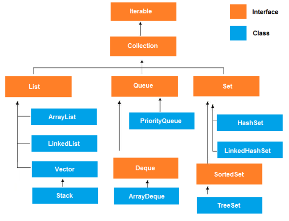

# <span style="color: green"> Generics: </span>

#### Что такое generic и для чего они нужны?
>Дженерики (или обобщения) - это параметризованные типы.  
Параметризованные типы позволяют объявлять классы, интерфейсы и методы, где тип данных, 
которыми они оперируют, указан в виде параметра. Используя дженерики, можно создать 
единственный класс, например, который будет автоматически работать с 
разными типами данных.

#### Зачем вообще ввели дженерики? Как до дженериков программировали?
>для раннего обнаружения ошибки  
> благодаря generic мы можем использовать наш код повторно  
> До появления дженериков использовались коллекции (Java Collection Framework) для хранения объектов
любого типа, т.е. непатентованных.

#### Что можно параметризовать?
> <b>Можно</b> параметризировать только ссылочные типы.    
> <b>Нельзя</b> параметризировать примитивы, нельзя параметризировать enum, анонимные классы и классы-
исключения (Exception). Невозможно объявить статические поля, типы которых являются параметрами типа.
Невозможно использовать приведение или instanceOf с параметризированными типами.

#### Как параметризовать статический метод?
> Так же, как и обычный метод, но с одним отличием – перед возвращаемым значением должен явно быть
указан дженерик. Статические методы не могут иметь или обращаться к generic-полям.
```java
public static <T> void staticMethod(T t) {}
public static <T> T staticMethod (T t) {return ….}
```

#### Что такое raw type? К чему приводит использование raw type?
> Raw type - это класс-дженерик, из которого удалили его тип.  
> Это имя универсального класса или интерфейса без каких-либо аргументов типа  
> Нужен для обратной совместимости.  
> Придется каждый раз использовать явное приведение типов, отсутствие типобезопасности – что может
привести к ошибкам во время Runtime.

#### Если поле типизировано дженериком как в байт коде будет представлен этот тип?
> как Object ?

#### Что такое даймонд оператор?
>Оператор <> был введен в Java 7, чтобы сделать код более читабельным и, по сути, является синтаксическим
сахаром. <> добавляет вывод типов и уменьшает многословность при использовании дженериков.
Компилятор, видя справа <>, смотрит на левую часть, где расположено объявление типа переменной, в
которую присваивается значение. И по этой части понимает, каким типом типизируется значение справа.

#### Что такое wildcard?
> Wildcard – это дженерик вида &lt;?&gt;, что означает, что тип может быть чем угодно
(List&lt;?&gt; - лист неизвестного типа).


# <span style="color: green"> Коллекции: </span>
#### Расскажи про иерархию коллекций?
> <b>Коллекции</b> – это хранилища, поддерживающее различные способы накопления и упорядочения объектов с
целью обеспечения возможностей эффективного доступа к ним.
Коллекции похожи на массивы, но имеют намного большей возможностей. Основной функционал определен в
интерфейсе Collection.  
<p align="center">
  
</p>

>- <b>Collection:</b>  
Этот интерфейс позволяет нам работать с группами объектов.
>- <b>List:</b>  
Наследует класс Collection и является упорядоченным списком элементов.
>- <b>Set:</b>  
Наследует класс Collection, и содержит множество уникальных элементов.
>- <b>SortedSet:</b>  
Наследует Set и является упорядоченным множеством уникальных элементов.
>- <b>Map:</b>  
Хранит уникальные элементы типа “ключ – значение”. Ключи уникальны, а значения могут повторяться. Порядок элементов не гарантирован. Map позволяет искать объекты (значения) по ключу. Map не наследуется от интерфейса Collection, но входит в состав фреймворка Collections.
>- <b>Map.Entry:</b>    
Описывает элемент в Map. Внутренний класс Map.
>- <b>SortedMap:</b>    
Расширяет класс Map, и сортирует элементы по возрастанию.
>- <b>Enumeration:</b>    
Интерфейс, который определяет методы для “перебора” элементов в коллекции. Заменён интерфейсом Iterator.

#### Почему Map не входит в Collection?
>List, Set и Queue это коллекции однотипных объектов, тогда как Map это подразумевает 2 типа объектов (пар ключ-значение). Соответственно некоторые методы интерфейса Collection нельзя использовать в Map.
   Например, метод remove(Object o) в интерфейсе Collection предназначен для удаления элемента, тогда как такой же метод    remove(Object key) в интерфейсе Map - удаляет элемент по заданному ключу.

#### Расскажи отличие List от Set?
><b>List:</b>  
   Наследует класс Collection и является упорядоченным списком элементов.  
<b>Set:</b>  
   Наследует класс Collection, и содержит множество уникальных неупорядоченых элементов.
> 
>List хранит объекты в порядке вставки, элемент можно получить по индексу.
Set не может хранить одинаковых элементов.

#### Расскажи отличие ArrayList от LinkedList?
>ArrayList - это список на основе массива.  
LinkedList - связанный список на основе элементов и связи между ними.

#### Когда лучше использовать ArrayList, а когда LinkedList?
>ArrayList - это список на основе массива.
LinkedList - связанный список на основе элементов и связи между ними.  
Если часто вставляете/удаляете элементы - выбираем LinkedList, в противном 
случае ArrayList.  
<b>LinkedList</b>, когда требуется провести много операций именно вначале списка. 
Так как перебор элементов списка предположим до середины будет занимать много 
времени, тогда как сама вставка/удаление пройдет за константное время.  
<b>ArrayList</b> - при вставке / удалении элемента в середине списка вызывает 
смещение элементов, но проводится оно, нативной низко-уровневой командой 
System.arraycopy и не занимает много времени, так же в ArrayList нет дополнительных 
расходов на хранение связки между элементами.

#### В чём разница между Queue и Deque и Stack?
><b>Queue</b> (односторонняя очередь) - когда элементы можно получить в том порядке, в котором добавляли (FIFO).  
<b>Deque</b> (двусторонняя очередь) - можно вставлять/получать элементы из начала и конца. (LIFO / FIFO)  
<b>Stack</b> работает по схеме LIFO. Всякий раз, когда вызывается новый метод, содержащий примитивные
значения или ссылки на объекты, то на вершине стека под них выделяется блок памяти.

#### Отличие двусвязного и односвязного списка?
>Двусвязный список похож на обычный связный список, только элементы в нем хранят 
ссылки не только на следующий, но и на предыдущий элемент. Благодаря этому
свойству, можно перемещаться по списку вперед и назад.

#### Как работает HashSet?
>Несколько важных пунктов о HashSet:
> 
>Т.к. класс реализует интерфейс Set, он может хранить только уникальные значения;  
Может хранить NULL – значения;  
Порядок добавления элементов вычисляется с помощью хэш-кода;  
HashSet также реализует интерфейсы Serializable и Cloneable.
> 
#### Как работает HashMap?
>Структура данных, которая хранит пары ключ-значение. Класс HashMap наследуется от класса AbstractMap
и реализует следующие интерфейсы: Map, Cloneable, Serializable.  
HashMap это фактически массив Нодов (Node), каждый элемент массива образует
односвязный список Нодов (LinkedList). Каждому элементу массива соответствует один список.
HashMap работает по принципам хеширования. Хеширование - это способ преобразования
любой переменной/объекта в уникальный код после применения любой формулы/алгоритма
к их свойствам.  
Node – это вложенный класс внутри HashMap, который имеет поля int hash, K key, V value,
Node <K,V> next (ссылка на следующий объект). Node образуют структуру односвязного LinkedList.

#### Как работает метод contains в ArrayList, LinkedList, HashSet?
>Метод contains в `Arraylist` использует метод `indexOf()`, который использует в свою 
очередь метод `indexOfRange()`. Там совершается обход элементов в цикле и если элемент
не null, то вызывается стандартный метод `equals` (сравнение ссылок).  
То же самое для `LinkedList`.  
В методе `contains` `HashSet` используются «корзины» и поиск объекта происходит сначала 
по hashcode, а только потом по equals.

#### В чём разница между Iterable и Iterator?
><b>Iterable</b> – интерфейс в котором есть один метод, который возвращает iterator.  
<b>Iterator</b> – это объект с состоянием итерации.

#### Что такое Iterator?
>Это объект с состоянием итерации. Он позволяет проверить, есть ли в нем следующий элемент,
используя hasNext() и перейти к следующему элементу используя next(). 
Так же имеет метод remove().

#### В каких случаях нужно использовать iterator? И почему?
>Можно использовать итератор в случае если есть необходимость удаления элементов из
коллекции при обходе (при использовании для удаления for each будет выброшено 
исключение ConcurrentModificationEx).

#### Что такое Map? Что должно быть уникальным?
>Map – интерфейс. Map содержит пары ключ - значение (Entry). Map должна содержать 
уникальные ключи.

#### Может ли null быть ключём в HashMap?
>HashMap оперирует с null-ключом без каких-либо проблем, хэшкод у null в HashMap = 0

#### Как работает HashMap? Расскажите подробно, как работает метод put? Что происходит при коллизии?
>
#### Как работает метод get в HashMap?
>